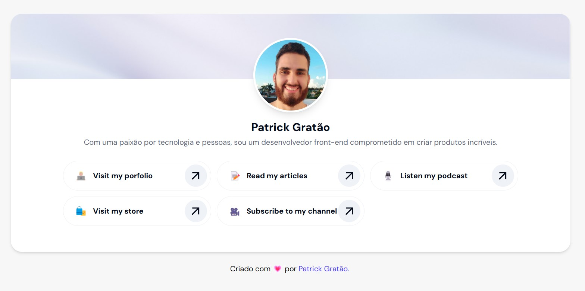

<h1 align="center" >
     
      
      
</h1>

<h1 align="center">
    Link in Bio com Tailwind e React
</h1>
 

  <a href="#visão-geral">Visão geral</a>&nbsp;&nbsp;&nbsp;|&nbsp;&nbsp;&nbsp;
  <a href="#organização-de-pastas-e-arquivos">Organização de pastas e arquivos</a>&nbsp;&nbsp;&nbsp;|&nbsp;&nbsp;&nbsp;
  <a href="#como-instalar?">Como instalar</a>&nbsp;&nbsp;&nbsp;

# Visão Geral

Projeto criado para o Join Community 2024.

- [Protótipo no Figma](https://www.figma.com/design/VcuQK0pTmzsgMJjfYFDJE5/Link-In-bio?node-id=1-5&t=O4JARphyhPBjJEVs-1)

## Tecnologias utilizadas

- ⚛️ React 18
- ⛑ TypeScript
- ⛑ Vite
- 📏 Biome JS - Linter e Formatter
- 🖌 Styled components e [Tailwind](https://tailwindcss.com/)
- 🧪 Vitest e React Testing Library

# Organização de Pastas e Arquivos

## Pasta `public`

Esta pasta contém os arquivos de públicos do app e também logo e favicon.

## Pasta `src`

Esta pasta contém os arquivos que utilizaremos no dia a dia da aplicação.

### Subpasta `src/components`

Nesta subpasta estarão presentes os arquivos de componentes da aplicação.

### Subpasta `src/pages`

Dentro desta pasta estão as páginas da aplicação.

Que deverão ser instanciadas no arquivo Routes.tsx

### Subpasta `src/styles`

Nesta subpasta estarão presentes os arquivos de estilo.

# Como instalar?

## Requisitos Mínimos

1. Necessário ter no mínimo o npm `9.5`
2. Necessário ter no mínimo o node `18.14.x`

## Instalação

1.  Baixe ou clone este repositório
2.  Acesse a pasta baixada e instale as dependências com `npm install` ou `yarn install`
3.  Rode o comando `npm run dev`

Após rodar o comando de `run` será aberto uma janela com a url `localhost:3000`.

## Rodar os Testes

1.  Rode o comando `npm run test`

---

Feito com 💗 pelo [Patrick Gratão](https://www.linkedin.com/in/patrickgratao/)
